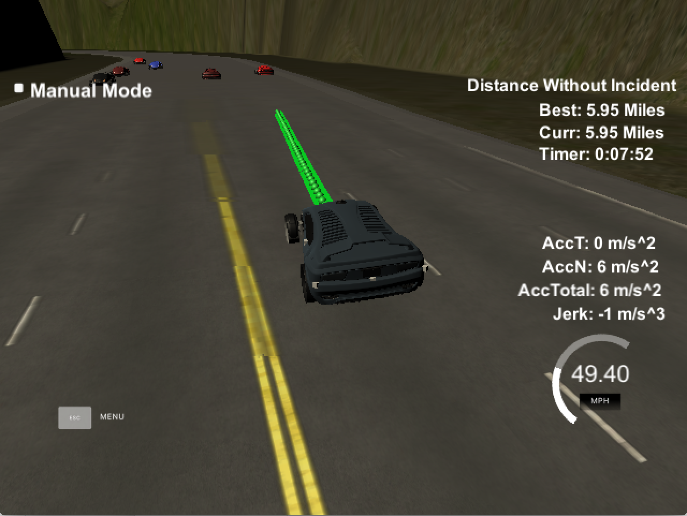

# CarND-Path-Planning-Project
Self-Driving Car Engineer Nanodegree Program
   
### Simulator.
You can download the Term3 Simulator which contains the Path Planning Project from the [releases tab (https://github.com/udacity/self-driving-car-sim/releases/tag/T3_v1.2).

### Goals
In this project your goal is to safely navigate around a virtual highway with other traffic that is driving +-10 MPH of the 50 MPH speed limit. You will be provided the car's localization and sensor fusion data, there is also a sparse map list of waypoints around the highway. The car should try to go as close as possible to the 50 MPH speed limit, which means passing slower traffic when possible, note that other cars will try to change lanes too. The car should avoid hitting other cars at all cost as well as driving inside of the marked road lanes at all times, unless going from one lane to another. The car should be able to make one complete loop around the 6946m highway. Since the car is trying to go 50 MPH, it should take a little over 5 minutes to complete 1 loop. Also the car should not experience total acceleration over 10 m/s^2 and jerk that is greater than 10 m/s^3.

#### The map of the highway is in data/highway_map.txt
Each waypoint in the list contains  [x,y,s,dx,dy] values. x and y are the waypoint's map coordinate position, the s value is the distance along the road to get to that waypoint in meters, the dx and dy values define the unit normal vector pointing outward of the highway loop.

The highway's waypoints loop around so the frenet s value, distance along the road, goes from 0 to 6945.554.

## Basic Build Instructions

1. Clone this repo.
2. Make a build directory: `mkdir build && cd build`
3. Compile: `cmake .. && make`
4. Run it: `./path_planning`.

Here is the data provided from the Simulator to the C++ Program

#### Main car's localization Data (No Noise)

["x"] The car's x position in map coordinates

["y"] The car's y position in map coordinates

["s"] The car's s position in frenet coordinates

["d"] The car's d position in frenet coordinates

["yaw"] The car's yaw angle in the map

["speed"] The car's speed in MPH

#### Previous path data given to the Planner

//Note: Return the previous list but with processed points removed, can be a nice tool to show how far along
the path has processed since last time. 

["previous_path_x"] The previous list of x points previously given to the simulator

["previous_path_y"] The previous list of y points previously given to the simulator

#### Previous path's end s and d values 

["end_path_s"] The previous list's last point's frenet s value

["end_path_d"] The previous list's last point's frenet d value

#### Sensor Fusion Data, a list of all other car's attributes on the same side of the road. (No Noise)

["sensor_fusion"] A 2d vector of cars and then that car's [car's unique ID, car's x position in map coordinates, car's y position in map coordinates, car's x velocity in m/s, car's y velocity in m/s, car's s position in frenet coordinates, car's d position in frenet coordinates. 

## Details

1. The car uses a perfect controller and will visit every (x,y) point it recieves in the list every .02 seconds. The units for the (x,y) points are in meters and the spacing of the points determines the speed of the car. The vector going from a point to the next point in the list dictates the angle of the car. Acceleration both in the tangential and normal directions is measured along with the jerk, the rate of change of total Acceleration. The (x,y) point paths that the planner recieves should not have a total acceleration that goes over 10 m/s^2, also the jerk should not go over 50 m/s^3. (NOTE: As this is BETA, these requirements might change. Also currently jerk is over a .02 second interval, it would probably be better to average total acceleration over 1 second and measure jerk from that.

2. There will be some latency between the simulator running and the path planner returning a path, with optimized code usually its not very long maybe just 1-3 time steps. During this delay the simulator will continue using points that it was last given, because of this its a good idea to store the last points you have used so you can have a smooth transition. previous_path_x, and previous_path_y can be helpful for this transition since they show the last points given to the simulator controller with the processed points already removed. You would either return a path that extends this previous path or make sure to create a new path that has a smooth transition with this last path.

## Tips

A really helpful resource for doing this project and creating smooth trajectories was using http://kluge.in-chemnitz.de/opensource/spline/, the spline function is in a single hearder file is really easy to use.

---

## Dependencies

* cmake >= 3.5
  * All OSes: [click here for installation instructions](https://cmake.org/install/)
* make >= 4.1
  * Linux: make is installed by default on most Linux distros
  * Mac: [install Xcode command line tools to get make](https://developer.apple.com/xcode/features/)
  * Windows: [Click here for installation instructions](http://gnuwin32.sourceforge.net/packages/make.htm)
* gcc/g++ >= 5.4
  * Linux: gcc / g++ is installed by default on most Linux distros
  * Mac: same deal as make - [install Xcode command line tools]((https://developer.apple.com/xcode/features/)
  * Windows: recommend using [MinGW](http://www.mingw.org/)
* [uWebSockets](https://github.com/uWebSockets/uWebSockets)
  * Run either `install-mac.sh` or `install-ubuntu.sh`.
  * If you install from source, checkout to commit `e94b6e1`, i.e.
    ```
    git clone https://github.com/uWebSockets/uWebSockets 
    cd uWebSockets
    git checkout e94b6e1
    ```

## Editor Settings

We've purposefully kept editor configuration files out of this repo in order to
keep it as simple and environment agnostic as possible. However, we recommend
using the following settings:

* indent using spaces
* set tab width to 2 spaces (keeps the matrices in source code aligned)

## Code Style

Please (do your best to) stick to [Google's C++ style guide](https://google.github.io/styleguide/cppguide.html).

## [Rubric] (https://review.udacity.com/#!/rubrics/1020/view) points

### Compilation

#### The code compiles correctly.

The code compiles without errors with cmake and make as described in Basic Build Instructions.  `CMakeLists.txt` was  modified to include a helper class .cpp file.

### Valid Trajectories

#### The car is able to drive at least 4.32 miles without incident.

The car is driving safely more than 4.32 miles without incident.



#### The car drives according to the speed limit.

The car does not exceed the speed limit of 50 mph. The car is driving as fast as possible as long as the traffic allows (please see the animation bellow).

#### Max Acceleration and Jerk are not Exceeded.

The car does not exceed a total acceleration of 10 m/s^2 and a jerk of 10 m/s^3 (please see the animation bellow).

#### Car does not have collisions.

The car does not come into contact with any of the other cars on the road. In order to change the lane the car considers not only a gap in front but also the car's distance and velocity behind it in the lane it wants to switch to  (please see the animation bellow).

#### The car stays in its lane, except for the time between changing lanes.

The car doesn't spend more than a 3 second length out side the lane lanes during changing lanes, and every other time the car stays inside one of the 3 lanes on the right hand side of the road (please see the animation bellow).

#### The car is able to change lanes.

The car is able to smoothly change lanes when it makes sense to do so, such as when behind a slower moving car and an adjacent lane is clear of other traffic.


### Reflection

#### There is a reflection on how to generate paths.

As recommeded in the project's classroom [Spline] (http://kluge.in-chemnitz.de/opensource/spline/) single header library was used to generate path trajectories. A set of sparce waypoints ahead of the starting reference has been created. The points are equally separated in space 30 meters apart from each other and include the lane as a variable parameter ([lines 364-367](./src/main.cpp#L364)). Spline is used to fit those points ([lines 388-391](./src/main.cpp#L388)) that have to be converted before from global coordinate space to the car's local ([lines 377-385](./src/main.cpp#L377)) to simplify the path generation and further computations since the car's angle will remains zero in local coordinate frame. To ensure continuoity of the path, last two points of the previous path are considered (if exist) to create a path that is tangent to the angle of the car (see [lines 334-362](./src/main.cpp#L334)). Also remaining points od the previous path are used for the new path to ensure a smooht transition between pathes ([lines 395-399](./src/main.cpp#L395)). 

To be able to go with a desired velocity along the spline the path points need to be evenly spaced to make sure there are no jerks and too high accelerations. It turns out a simple trigonometry is enough to approximate that with an equation `N * .02 * vel = d`, where `N` is a number of points  we want the path to have, `0.02` is how often the point will be visited by the car in sec, `vel` is our desired velocity, and `d` is an Euclidean distance between the beginning (car's position) and the end of the spline (our target waypoint) (please see [lines 402-413](./src/main.cpp#L402)). 

The last two peices of the problem is a behaviour. We need to ensure that we don't collide with a car in front of us as well as deciding and safely executing the lane change. For not colliding into the car in front of us we are identifying which car in front of us is in our lane and compute how close we would be to it considering our pevious path and that car's actual velocity. Based on that distance measurement I have implemented a two-step control: if we are getting close, we try to maintain the speed of the car in front of us, but if we are getting dangerously close, we are fastly decelerating. Once the distance is becoming safe enough but we are too slow, we are accelerating. It is a slight modification of the original concept presented in the project walkthrough in the classroom (see [lines 274-318](./src/main.cpp#L274)). 

To decide on changing the lane a [`Helper`](./src/helper.cpp) class has been implemented. It implements a method to get a closest car in tha lane based on the threshold parameter and the sensor fusion data we receive from the simulator ([Lines 21-40](./src/helper.cpp#L21)). This information is a basis to decide which is the best lane to switch to - the one that has the largest gap in front of us (see lines [Lines 42-52](./src/helper.cpp#L42)). Thus using this logic in [lines 270-271](./src/main.cpp#L270) we end up knowing which lane is the best to take given the trafic situation. What remains is to reason about if it is safe to do it now. For this, we defined two parameters that we initialize in the [helper class constructor](./src/helper.cpp#L13): distance behind us and distance in front of us in the lane where we want to change to. Additionally to maintain the optimum speed we are switching to a new lane in advance currently as soon as we are getting as close as 60 meters.  This is done with a help of an auxiliary flag [`getting_close`](./src/helper.cpp#L300). The state machine is implemented inside the helper class method [`get_next_lane()`](./src/helper.cpp#L54) that is using another helper boolean decision method [`safe_to_change()`](./src/helper.cpp#L96). In [line 320](./src/main.cpp#L320) of the main fuction you see this decision being taken. As soon as all safety criteria are met the `get_next_lane()` method will output a new lane that will be taken by the above described path trajectory generator and the car will safely change the lane. If the best lane would be the one over the next lane, the `get_next_lane()`  method ensures we change only one lane at a time. 
